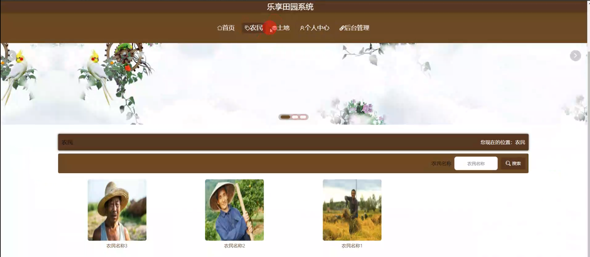
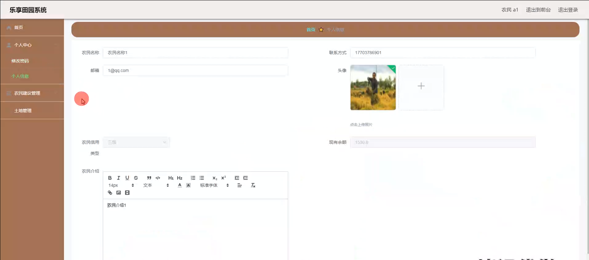

# 基于springboot的乐享田园系统

#### 介绍

随着人们对乡村生活的向往和对绿色、健康农产品需求的增加，农业与互联网的结合成为了一种趋势。然而，当前的农业信息化系统在功能完整性、用户体验和数据管理等方面仍存在不足。在此背景下，基于 Spring Boot 的乐享田园系统应运而生，旨在为管理端、农民端和用户端提供一个便捷、高效的交流与合作平台。

#### 技术栈

后端技术栈：Springboot+Mysql+Maven

前端技术栈：Vue+Html+Css+Javascript+ElementUI

开发工具：Idea+Vscode+Navicate

#### 系统功能介绍

（一）管理端  
个人中心：管理端人员可以在个人中心查看和修改自己的个人信息，查看操作记录和系统通知。  
基础数据管理：维护系统运行所需的基础数据，如农作物种类、种植技术标准、市场价格等。  
农民管理：对农民的注册信息、资质审核、信用评级等进行管理。  
农民建议管理：收集和处理农民提出的建议和反馈，以改进系统和服务。  
土地管理  
土地管理：对土地的基本信息进行登记和更新，包括土地位置、面积、土壤条件等。  
土地评价管理：评估土地的质量和适宜种植的农作物类型。  
土地收藏管理：记录用户对感兴趣土地的收藏操作，便于后续关注和交易。  
土地订单管理：处理土地的租赁、买卖等订单，确保交易的顺利进行。  
种植详情管理：了解土地上的农作物种植情况，包括种植品种、种植时间、生长阶段等。  
用户管理：管理用户的注册信息、权限设置、消费记录等。  
用户建议管理：处理用户提出的意见和建议，提升用户满意度。  
轮播图信息：设置首页的轮播图内容，展示优质土地资源、特色农产品、田园风光等，吸引用户关注。  

（二）农民端  
农民模块：展示农民的个人信息、种植经验、农产品供应等。  
土地模块：管理自己拥有的土地信息，查看土地评价和种植详情。  
个人中心：修改个人资料、查看土地交易记录和收益情况等。  
后台管理  
农民建议管理：向管理端提出改进系统和服务的建议。  
土地管理  
土地管理：对土地进行自主管理和信息更新。  
土地评价管理：参与土地质量的评价和反馈。  
土地收藏管理：收藏感兴趣的其他土地信息。  
土地订单管理：处理与自己土地相关的订单。  
种植详情管理：记录和更新土地上农作物的种植详情。  

（三）用户端  
农民模块：查看农民的详细信息，选择合作的农民。  
土地模块：浏览和筛选可用土地，了解土地详情。  
个人中心：管理个人信息、查看土地租赁或购买记录等。  
后台管理  
农民建议管理：向管理端反馈与农民合作的体验和建议。  
土地管理  
土地管理：对关注的土地进行管理和跟踪。  
土地评价管理：对租赁或购买的土地进行评价。  
土地收藏管理：收藏心仪的土地。  
土地订单管理：提交土地租赁或购买订单。  
种植详情管理：了解所租赁或购买土地上的种植详情。  

#### 系统作用

促进土地资源合理利用  
通过系统的土地管理功能，实现土地信息的精准匹配，提高土地的利用率。  

加强农民与用户的合作  
为农民和用户提供直接交流和合作的平台，减少中间环节，增加双方收益。  

提升农业生产效率  
基于土地评价和种植详情管理，为农民提供科学的种植指导，提高农产品产量和质量。  

满足用户的田园需求  
使用户能够便捷地参与田园活动，享受田园生活的乐趣。  

推动农业信息化发展  
整合农业资源和信息，促进农业产业的数字化升级。  

#### 系统功能截图

代码结构

数据库表

登录

前台页面首页

土地模块

个人中心

农民模块

管理员端农民管理

用户管理

轮播图信息管理

农民端个人信息

土地评价管理

种植详情管理

用户端后台管理

用户建议管理

#### 总结

基于 Spring Boot 的乐享田园系统为农业发展带来了新的机遇和模式。然而，系统在实际运行中可能面临数据安全风险、农民和用户对新技术的接受程度不同、市场变化对土地价值评估的影响等问题。未来，我们将不断完善系统功能，加强数据保护，提高用户体验，以更好地满足农业发展和用户需求，为乡村振兴和农业现代化贡献力量。

#### 使用说明

创建数据库，执行数据库脚本 修改jdbc数据库连接参数 下载安装maven依赖jar 启动idea中的springboot项目

前台登录页面
http://localhost:8080/lexiangtianyuan/front/index.html

后台登录页面
http://localhost:8080/lexiangtianyuan/admin/dist/index.html

管理员				账户:admin 		密码：admin

农民				账户:a1 		密码：123456

用户				账户:a1 		密码：123456